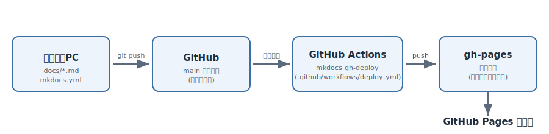

# MkDocs + GitHub Pages 公開ガイド

このサイトは、Markdownで書いたドキュメントを **MkDocs** でサイト化し、
**GitHub Pages** で無料公開するまでの手順を、自分で再現できるレベルでまとめたものです。

## 全体の流れ

1. ローカルPCで Markdown ファイルを編集する
2. GitHubのリポジトリに `git push` する
3. push をきっかけに **GitHub Actions** が自動でビルドする
4. ビルド結果が `gh-pages` ブランチに送られる
5. **GitHub Pages** がそのブランチの内容を世界に公開する

一度この仕組みを作ってしまえば、以降は **Markdownを編集してpushするだけ** で
サイトが自動更新されます。手動でのアップロード作業は不要です。

## 章の構成

| 章 | 内容 |
|---|---|
| [1. Python環境の準備](01-python-setup.md) | MkDocsを動かすための土台づくり |
| [2. mkdocsのインストールとサイト作成](02-mkdocs-install.md) | サイトの雛形を作る |
| [3. GitHubリポジトリの作成とpush](03-github-repo.md) | コードをGitHubに置く |
| [4. GitHub Actionsによる自動デプロイ](04-github-actions.md) | push→公開を自動化する |
| [5. GitHub Pagesの公開設定](05-github-pages.md) | 公開のスイッチを入れる |
| [6. ローカルでのプレビュー方法](06-local-preview.md) | 公開前に手元で確認する |
| [7. サイトデザインのカスタマイズ](07-customization.md) | 配色・ナビゲーション・コードブロックを整える |
| [8. 図解(Mermaid)と更新日表示](08-mermaid-and-revision-date.md) | 設計書向けに図と更新日を追加する |

## このサイトの公開先（実例）

https://okakalds.github.io/my-docs-site/

同じ手順で、自分のリポジトリ名・GitHubユーザー名に置き換えれば同様に公開できます。
